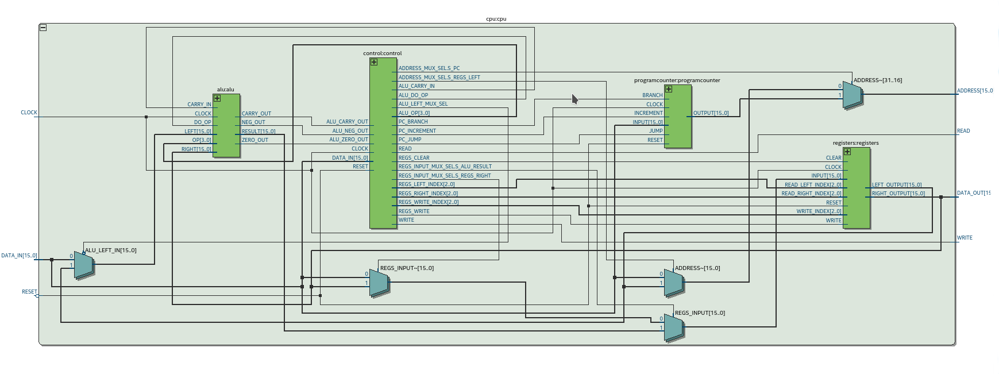

# 16 bit processor in VHDL

This is a project for self-learning, and is pretty much useless except for
anyone interested in how a simple processor could be implemented.  That
said, I think it's cool.

This is of course a work in progress.

# Summary of features

* 16 bit address and databuses
* 16 bit opcodes
* Byte and word size memory accesses, with signed/unsigned extension on byte reads
  - Bus error signal on unaligned word transfers
* Some opcodes (like LOADI, JUMPs, BRANCHes, ALUMI, CALLs) have one following immediate value/address
* 8 x 16 bit general purpose registers
* 16 bit Program Counter
* Load an immediate 16 bit quantity at the following address
* Load and store instructions operate either through a register, an immediate address or a register with an immediate displacement, or the program counter with an immediate displacement
* Clear instruction
* Simple status bits: zero, negative, carry
* ALU operations including
  - add, add with carry, subtract, subtract with carry, signed and unsigned 8 bit to 16 bit multiply, increment, decrement, and, or, xor, not, shift left, shift right, copy, negation, etc
* ALU operations are of the form DEST <= DEST op OPERAND, or DEST <= op DEST
  - ALUMI operates with an immediate operand, eg. add r0,#123
* Conditional and uncoditional jumps and branches: always, on each flag set or clear with don't cares
* Nop and Halt instructions
* Stacking: call/return and push and pop
* No microcode: a coded state machine is used
* Most instructions take 3 cycles
* CustomASM (https://github.com/hlorenzi/customasm) is the current assembler

# TODO

* Interrupts, including software traps
* Testbench for the controller
* Add more instructions!
  - (Better) multiply and divide?
  - Barrel shifter?
  - Restricting ALU ops to byte wide values might be useful, but probably not
  - ....
* Better status bits: not currently settable via an opcode, nor are they changed on anything other then an ALU instruction
  * This unfortuantely includes the LOADRD and STORED opcodes, which is confusing and wrong
* It should be possible to do a build without multiply support, as very small FPGAs will not have sufficent resources

# Top level RTL diagram (OUT OF DATE)



# Opcode map

<table>
<tr>
<td width='10%'>Opcode</td>
<td width='5%'>15</td>
<td width='5%'>14</td>
<td width='5%'>13</td>
<td width='5%'>12</td>
<td width='5%'>11</td>
<td width='5%'>10</td>
<td width='5%'>9</td>
<td width='5%'>8</td>
<td width='5%'>7</td>
<td width='5%'>6</td>
<td width='5%'>5</td>
<td width='5%'>4</td>
<td width='5%'>3</td>
<td width='5%'>2</td>
<td width='5%'>1</td>
<td width='5%'>0</td>
</tr>
<tr>
<td>NOP</td>
<td colspan='6'>0b000000</td>
<td colspan='10'>-</td>
</tr>
<tr>
<td colspan='17'>Do nothing</td>
</tr>
<tr>
<td>JUMP</td>
<td colspan='6'>0b000010</td>
<td colspan='4'>-</td>
<td colspan='3'>Flag cares</td>
<td colspan='3'>Flag polariy</td>
</tr>
<tr>
<td colspan='17'>If (Flags AND Flag cares = Flag polarity) then PC &leftarrow; IMMEDIATE</td>
</tr>
<td>BRANCH</td>
<td colspan='6'>0b000011</td>
<td colspan='4'>-</td>
<td colspan='3'>Flag cares</td>
<td colspan='3'>Flag polariy</td>
</tr>
<tr>
<td colspan='17'>If (Flags AND Flag cares = Flag polarity) then PC &leftarrow; PC + IMMEDIATE</td>
</tr>
<tr>
<td>CLEAR</td>
<td colspan='6'>0b001100</td>
<td colspan='7'>-</td>
<td colspan='3'>Reg</td>
</tr>
<tr>
<td colspan='17'>Reg &leftarrow; 0</td>
</tr>
<tr>
<td>LOADI</td>
<td colspan='6'>0b000100</td>
<td>Byte</td>
<td>Signed</td>
<td colspan='5'>-</td>
<td colspan='3'>Dst reg</td>
</tr>
<tr>
<td colspan='17'>Dst reg &leftarrow; IMMEDIATE</td>
</tr>
<tr>
<td>LOADM</td>
<td colspan='6'>0b001000</td>
<td>Byte</td>
<td>Signed</td>
<td colspan='5'>-</td>
<td colspan='3'>Dst reg</td>
</tr>
<tr>
<td colspan='17'>Dst reg &leftarrow; [IMMEDIATE]</td>
</tr>
<tr>
<td>STOREM</td>
<td colspan='6'>0b001001</td>
<td>Byte</td>
<td>Signed</td>
<td colspan='5'>-</td><td colspan='3'>Src reg</td>
</tr>
<tr>
<td colspan='17'>[IMMEDIATE] &leftarrow; Src reg</td>
</tr>
<tr>
<td>LOADR</td>
<td colspan='6'>0b001010</td>
<td>Byte</td>
<td>Signed</td>
<td colspan='2'>-</td>
<td colspan='3'>Src addr reg</td>
<td colspan='3'>Dst reg</td>
</tr>
<tr>
<td colspan='17'>Dst reg &leftarrow; [Src addr reg]</td>
</tr>
<tr>
<td>STORER</td>
<td colspan='6'>0b001011</td>
<td>Byte</td>
<td>Signed</td>
<td colspan='2'>-</td>
<td colspan='3'>Dst addr reg</td>
<td colspan='3'>Src reg</td>
</tr>
<tr>
<td colspan='17'>[Dst addr reg] &leftarrow; Src reg</td>
</tr>
<tr>
<td>LOADRD</td>
<td colspan='6'>0b011010</td>
<td>Byte</td>
<td>Signed</td>
<td colspan='2'>-</td>
<td colspan='3'>Src addr reg</td>
<td colspan='3'>Dst reg</td>
</tr>
<tr>
<td colspan='17'>Dst reg &leftarrow; [Src addr reg + IMMEDIATE]</td>
</tr>
<tr>
<td>STORERD</td>
<td colspan='6'>0b011011</td>
<td>Byte</td>
<td>Signed</td>
<td colspan='2'>-</td>
<td colspan='3'>Dst addr reg</td>
<td colspan='3'>Src reg</td>
</tr>
<tr>
<td colspan='17'>[Dst addr reg + IMMEDIATE] &leftarrow; Src reg</td>
</tr>
<tr>
<td>LOADPCD</td>
<td colspan='6'>0b011110</td>
<td>Byte</td>
<td>Signed</td>
<td colspan='5'>-</td>
<td colspan='3'>Dst reg</td>
</tr>
<tr>
<td colspan='17'>Dst reg &leftarrow; [PC reg + IMMEDIATE]</td>
</tr>
<tr>
<td>STOREPCD</td>
<td colspan='6'>0b011111</td>
<td>Byte</td>
<td>Signed</td>
<td colspan='5'>-</td>
<td colspan='3'>Src reg</td>
</tr>
<tr>
<td colspan='17'>[PC reg + IMMEDIATE] &leftarrow; Src reg</td>
</tr>
<tr>
<td>ALUM</td>
<td colspan='6'>0b001110</td>
<td colspan='4'>ALU multi op</td>
<td colspan='3'>Operand reg</td>
<td colspan='3'>Dst reg</td>
</tr>
<tr>
<td colspan='17'>Dst reg &leftarrow; Dst reg <i>ALU mlti op</i> Src reg</td>
</tr>
<tr>
<td>ALUS</td>
<td colspan='6'>0b001111</td>
<td colspan='4'>ALU single op</td>
<td colspan='3'>-</td>
<td colspan='3'>Dst reg</td>
</tr>
<tr>
<td colspan='17'>Dst reg &leftarrow; <i>ALU single op</i> Dst reg</td>
</tr>
<tr>
<td>ALUMI</td>
<td colspan='6'>0b011000</td>
<td colspan='4'>ALU multi op</td>
<td colspan='3'>-</td>
<td colspan='3'>Dst reg</td>
</tr>
<tr>
<td colspan='17'>Dst reg &leftarrow; Dst reg <i>ALU multi op</i> IMMEDIATE</td>
</tr>
<tr>
<td>CALLJUMP *</td>
<td colspan='6'>0b010000</td>
<td colspan='4'>-</td>
<td colspan='3'>Stack reg</td>
<td colspan='3'>Stack reg</td>
</tr>
<tr>
<td colspan='17'>Stack reg &leftarrow; Stack reg - 2 ; [Stack reg] &leftarrow; PC ;  PC &leftarrow; IMMEDIATE</td>
<tr>
<td>CALLBRANCH</td>
<td colspan='6'>0b010001</td>
<td colspan='4'>-</td>
<td colspan='3'>Stack reg</td>
<td colspan='3'>Stack reg</td>
</tr>
<tr>
<td colspan='17'>Stack reg &leftarrow; Stack reg - 2 ; [Stack reg] &leftarrow; PC ;  PC &leftarrow; PC + IMMEDIATE</td>
<tr>
<tr>
<td>RETURN</td>
<td colspan='6'>0b010010</td>
<td colspan='4'>-</td>
<td colspan='3'>Stack reg</td>
<td colspan='3'>Stack reg</td>
</tr>
<tr>
<td colspan='17'>PC &leftarrow; [Stack reg] ; Stack reg &leftarrow; Stack reg + 2 </td>
<tr>
<td>PUSHQUICK</td>
<td colspan='6'>0b010100</td>
<td colspan='4'>-</td>
<td colspan='3'>Stack reg</td>
<td colspan='3'>Src reg</td>
</tr>
<tr>
<td colspan='17'>Stack reg &leftarrow; Stack reg - 2 ; [Stack reg] &leftarrow; Src reg</td>
</tr>
<tr>
<td>POPQUICK</td>
<td colspan='6'>0b010101</td>
<td colspan='4'>-</td>
<td colspan='3'>Stack reg</td>
<td colspan='3'>Dst reg</td>
</tr>
<tr>
<td colspan='17'>Dst reg &leftarrow; [Stack reg] ; Stack reg &leftarrow; Stack reg + 2</td>
</tr>
</table>

## Flag cares and flag polarity

<table>
<tr>
<td>2</td>
<td>1</td>
<td>0</td>
</tr>
<td>Carry</td>
<td>Zero</td>
<td>Negative</td>
</tr>
</table>

## Registers

<table>
<tr>
<td>0b000</td>
<td>r0</td>
</tr>
<tr>
<td>0b001</td>
<td>r1</td>
</tr>
<tr>
<td>0b010</td>
<td>r2</td>
</tr>
<tr>
<td>0b011</td>
<td>r3</td>
</tr>
<tr>
<td>0b100</td>
<td>r4</td>
</tr>
<tr>
<td>0b101</td>
<td>r5</td>
</tr>
<tr>
<td>0b110</td>
<td>r6</td>
</tr>
<tr>
<td>0b111</td>
<td>r7</td>
</tr>
</table>

## ALU multi (destination and operand) operations

<table>
<tr>
<td>0b0000</td>
<td>Add</td>
</tr>
<tr>
<td>0b0001</td>
<td>Add with cary</td>
</tr>
<tr>
<td>0b0010</td>
<td>Subtract</td>
</tr>
<tr>
<td>0b0011</td>
<td>Subtract with cary</td>
</tr>
<tr>
<td>0b0100</td>
<td>Bitwise AND</td>
</tr>
<tr>
<td>0b0101</td>
<td>Bitwise OR</td>
</tr>
<tr>
<td>0b0110</td>
<td>Bitwise XOR</td>
</tr>
<tr>
<td>0b0111</td>
<td>Copy</td>
</tr>
<tr>
<td>0b1000</td>
<td>Compare</td>
</tr>
<tr>
<td>0b1001</td>
<td>Bitwise test</td>
</tr>
<tr>
<td>0b1010</td>
<td>Unsigned 8 bit to 16 bit multiply</td>
</tr>
<tr>
<td>0b1011</td>
<td>Signed 8 bit to 16 bit multiply</td>
</tr>
<tr>
<td>0b1100-0b1111
<td>Unused</td>
</tr>
</table>

## ALU single (destination only) operations

<table>
<tr>
<td>0b0000</td>
<td>Increment</td>
</tr>
</tr>
<td>0b0001</td>
<td>Decrement</td>
</tr>
<tr>
<td>0b0010</td>
<td>Double increment</td>
</tr>
<tr>
<td>0b0011</td>
<td>Double decrement</td>
</tr>
<tr>
<td>0b0100</td>
<td>Bitwise NOT</td>
</tr>
<tr>
<td>0b0101</td>
<td>Left shift</td>
</tr>
<tr>
<td>0b0110</td>
<td>Right shift</td>
</tr>
<tr>
<td>0b0111</td>
<td>Negation</td>
</tr>
<tr>
<td>0b1000</td>
<td>Byte swap</td>
</tr>
<tr>
<td>0b1001</td>
<td>Compare with zero</td>
</tr>
<tr>
<td>0b1010-0b1111
<td>Unused</td>
</tr>
</table>

# Sample code

The currently used [CustomASM](https://github.com/hlorenzi/customasm) CPU definition makes it possible to
write very presentable assembly by, for example, combing LOADI, LOADM, LOADR and LOADRD into a single "load"
mnemonic with the width represented by .w, .bu or .bs. ALU operations are similarly represented.

```asm
; prints the messsge in r2 at row r0 coloumn r1

printmsg:       shiftleft r0                    ; word wide address so shift
                load.w r0,(rowoffsets,r0)       ; get the start of the row
                add r0,r1                       ; add the column
.loop:          load.bu r1,(r2)                 ; get the char
                test r1                         ; checking for null
                branchz printmsgo               ; done?
                store.b (r0),r1                 ; output the char
                inc r2                          ; move to next source char
                inc r0                          ; move to next video addr
                branch .loop                    ; get more
printmsgo:      return                          ; done

; polls the ps2 port for a byte, returning 0 in r0 if nothing is available

getps2byte:     load.bu r0,PS2_STATUS           ; get from the status reg
                test r0                         ; nothing?
                branchz .nothing                ; keep waiting yet....
                load.bu r0,PS2_SCANCODE         ; get the scancode
                compare r0,#0xf0                ; break?
                branchz .nothing                ; no, carry on
                store.w SEVENSEG,r0             ; display it for debug
                return                          ; done
.nothing:       clear r0                        ; return 0
                return                          ; done
```

